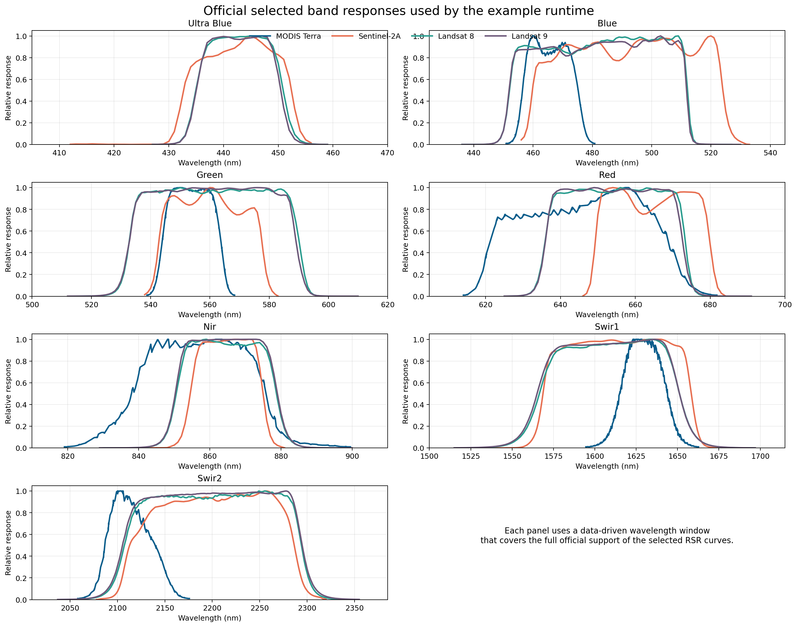
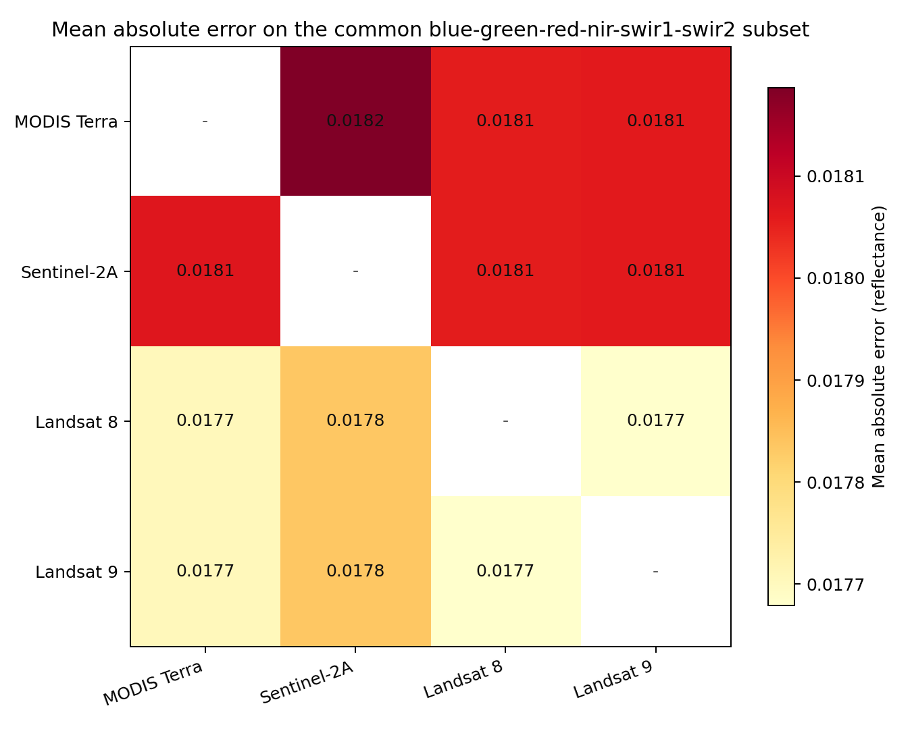
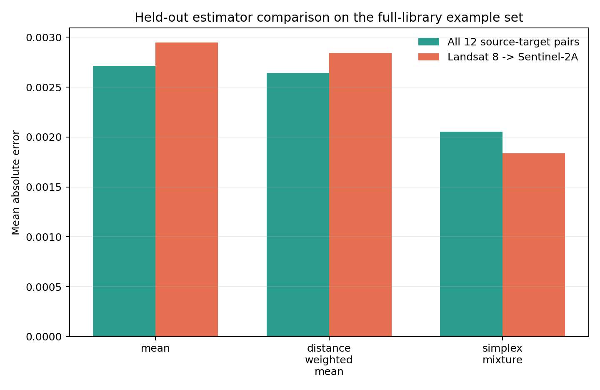
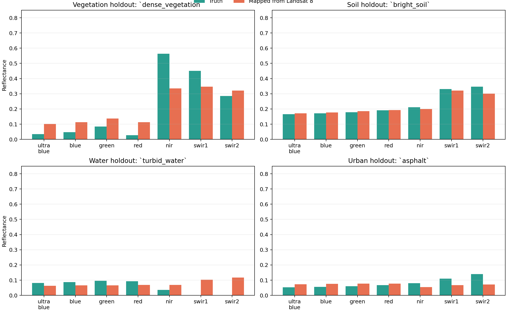
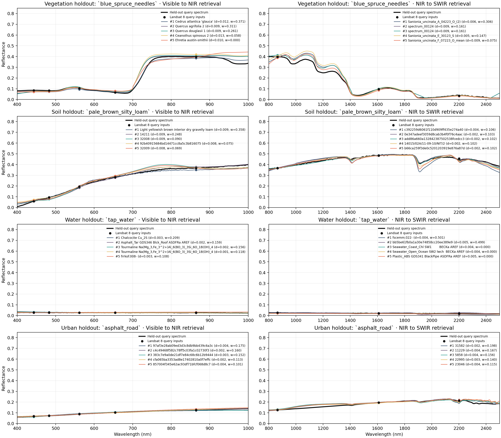

<!-- Generated by scripts/build_official_mapping_examples.py; do not edit by hand. -->
# Official Sensor Examples

This page shows the bundled cross-sensor example runtime built from official
relative spectral response sources for Terra MODIS, Sentinel-2A MSI, Landsat 8
OLI, and Landsat 9 OLI.

It uses four held-out class targets drawn from the previously composed full
SIAC library: one vegetation spectrum, one soil spectrum, one water spectrum,
and one urban spectrum. Those targets are simulated to each source sensor. For
each query, the examples exclude only the matching prepared `row_id`, leaving
the rest of the external full library available.

<div class="fact-grid">
  <div><strong>4 sensors</strong><span>MODIS, Sentinel-2A, Landsat 8, Landsat 9</span></div>
  <div><strong>4 held-out targets</strong><span>vegetation, soil, water, urban</span></div>
  <div><strong>77,125 library rows</strong><span>external full SIAC retrieval database</span></div>
  <div><strong>Example k</strong><span>public default `k = 10`</span></div>
  <div><strong>Example estimator</strong><span>`simplex_mixture`</span></div>
  <div><strong>Scored subset</strong><span>blue, green, red, nir, swir1, swir2</span></div>
  <div><strong>Library root</strong><span>`build/siac_spectral_library_real_full_raw_no_ghisacasia_no_understory_no_santa37`</span></div>
  <div><strong>Regenerated</strong><span>2026-03-18 UTC</span></div>
</div>

Related pages:

- [Mathematical Foundations](theory.md)
- [Official Example Bundle](example_bundle.md)

## Official Sources

| Sensor | Official source | Repository subset |
| --- | --- | --- |
| Terra MODIS | NASA MCST [Terra_RSR_in-band.xlsx](https://mcst.gsfc.nasa.gov/sites/default/files/file_attachments/Terra_RSR_in-band.xlsx) | [`examples/official_mapping/srfs/modis_terra.json`](../examples/official_mapping/srfs/modis_terra.json) |
| Sentinel-2A MSI | ESA Copernicus [COPE-GSEG-EOPG-TN-15-0007 - Sentinel-2 Spectral Response Functions 2024 - 4.0.xlsx](https://sentiwiki.copernicus.eu/__attachments/1692737/COPE-GSEG-EOPG-TN-15-0007%20-%20Sentinel-2%20Spectral%20Response%20Functions%202024%20-%204.0.xlsx) | [`examples/official_mapping/srfs/sentinel2a_msi.json`](../examples/official_mapping/srfs/sentinel2a_msi.json) |
| Landsat 8 OLI | USGS [Spectral Characteristics Viewer band JSON](https://landsat.usgs.gov/spectral-characteristics-viewer) | [`examples/official_mapping/srfs/landsat8_oli.json`](../examples/official_mapping/srfs/landsat8_oli.json) |
| Landsat 9 OLI | USGS [Spectral Characteristics Viewer band JSON](https://landsat.usgs.gov/spectral-characteristics-viewer) | [`examples/official_mapping/srfs/landsat9_oli.json`](../examples/official_mapping/srfs/landsat9_oli.json) |

The reduced JSON files and derived figures were regenerated from the official
upstream assets on `2026-03-18` UTC. Provenance, download timestamps,
and SHA-256 hashes are stored in
[`examples/official_mapping/official_source_manifest.json`](../examples/official_mapping/official_source_manifest.json).

Recorded upstream artifacts for this commit:

- Terra MODIS: `Terra_RSR_in-band.xlsx` SHA-256 `f14498183f9258ed691999313a13fc425edb2eb2d89ca676f79abbb6f48ad637`
- Sentinel-2A MSI: `Sentinel-2_Spectral_Response_Functions_2024_4.0.xlsx` SHA-256 `1a9edc27d692a570911a460d589f188da0fc3e27f0b0bd1ad322059c380519b0`
- Landsat 8 OLI: `7` official band JSON files recorded in [`examples/official_mapping/official_source_manifest.json`](../examples/official_mapping/official_source_manifest.json)
- Landsat 9 OLI: `7` official band JSON files recorded in [`examples/official_mapping/official_source_manifest.json`](../examples/official_mapping/official_source_manifest.json)

## What The Example Demonstrates

- held-out reconstruction on exact full-library spectra rather than synthetic mixtures
- target-sensor mapping between MODIS, Sentinel-2A, Landsat 8, and Landsat 9
- batch mapping from one CSV input
- full-spectrum reconstruction over `400-2500 nm`
- provenance tracking for official SRF inputs

## Held-Out Target Design

| Sample id | Class | Source | Prepared row id |
| --- | --- | --- | --- |
| `blue_spruce_needles` | `vegetation` | USGS Spectral Library v7 | `usgs_v7:usgs_v7_002183:Blue_Spruce DW92-5 needles    BECKa AREF` |
| `pale_brown_silty_loam` | `soil` | ECOSTRESS Spectral Library v1.0 | `ecostress_v1:ecostress_v1_002334:Pale brown silty loam` |
| `tap_water` | `water` | ECOSTRESS Spectral Library v1.0 | `ecostress_v1:ecostress_v1_003451:Tap water` |
| `asphalt_road` | `urban` | USGS Spectral Library v7 | `usgs_v7:usgs_v7_000004:Asphalt GDS376 Blck_Road old ASDFRa AREF` |

The retrieval library itself is not vendored under `examples/official_mapping`
because it contains `77,125` rows. Instead, the committed bundle
records the expected external SIAC root and the exact held-out rows in
[`examples/official_mapping/official_source_manifest.json`](../examples/official_mapping/official_source_manifest.json).

Current full-library landcover counts:

- `soil`: `60,905` rows
- `unlabeled`: `5,932` rows
- `urban`: `1,474` rows
- `vegetation`: `8,723` rows
- `water`: `91` rows

Each example command excludes only its own query spectrum:

- single-sample runs use `--exclude-row-id <row_id>`
- the batch input file carries an `exclude_row_id` column, one exact row id per query

That keeps the other held-out targets available as neighbors while still
preventing self-matches.

All generated outputs on this page use `k = 10` with
`--neighbor-estimator simplex_mixture`.
The overlay figure below plots the top `5` neighbors from
each segment’s `k = 10` retrieval for readability.

## Band Correspondence

| Semantic band | Terra MODIS | Sentinel-2A MSI | Landsat 8 OLI | Landsat 9 OLI |
| --- | --- | --- | --- | --- |
| `ultra_blue` | not present | `B1` | `Band 1` | `Band 1` |
| `blue` | `Band 3` | `B2` | `Band 2` | `Band 2` |
| `green` | `Band 4` | `B3` | `Band 3` | `Band 3` |
| `red` | `Band 1` | `B4` | `Band 4` | `Band 4` |
| `nir` | `Band 2` | `B8A` | `Band 5` | `Band 5` |
| `swir1` | `Band 6` | `B11` | `Band 6` | `Band 6` |
| `swir2` | `Band 7` | `B12` | `Band 7` | `Band 7` |

Sentinel-2 is represented here by the `S2A` sheet from the official ESA SRF
workbook. If you need `S2B` or `S2C`, the same conversion script can be pointed
at the corresponding official sheet.

## Rebuild The Example Bundle

Regenerate the sensor JSON, example queries, results, and plot assets:

```bash
python3 -m pip install ".[internal-build]"
python3 scripts/build_official_mapping_examples.py --siac-root build/siac_spectral_library_real_full_raw_no_ghisacasia_no_understory_no_santa37
```

That script downloads the official source assets, writes the reduced sensor
schemas into `examples/official_mapping/srfs`, rebuilds the example queries and
outputs against the external full SIAC library, refreshes the figures in
`docs/assets`, and rewrites this page from the generated outputs. It requires
network access for the upstream SRF files and expects the full SIAC library to
already exist at `build/siac_spectral_library_real_full_raw_no_ghisacasia_no_understory_no_santa37` or at the path passed by `--siac-root`.

## Prepare The Runtime

Use the previously composed full SIAC library and the official-source SRF JSONs:

```bash
spectral-library prepare-mapping-library \
  --siac-root build/siac_spectral_library_real_full_raw_no_ghisacasia_no_understory_no_santa37 \
  --srf-root examples/official_mapping/srfs \
  --source-sensor modis_terra \
  --source-sensor sentinel2a_msi \
  --source-sensor landsat8_oli \
  --source-sensor landsat9_oli \
  --output-root build/official_mapping_runtime
```

Validate the prepared runtime:

```bash
spectral-library validate-prepared-library \
  --prepared-root build/official_mapping_runtime
```

## Visual Comparison

Selected official band responses used by the example runtime:



Mean absolute target-band error across the four held-out class targets,
evaluated only on the common comparable subset
`blue`, `green`, `red`, `nir`, `swir1`, `swir2`:



Observed range in the bundled example:

- lowest comparable mean absolute band error:
  `0.0016` for Landsat 9 -> Landsat 8
- highest comparable mean absolute band error:
  `0.0026` for MODIS Terra -> Sentinel-2A
- pairwise metrics on this page were generated with `neighbor_estimator = simplex_mixture`

The full pairwise summary, including `evaluated_band_ids` and
`evaluated_band_count`, is in
[`examples/official_mapping/results/metrics/pairwise_band_metrics.csv`](../examples/official_mapping/results/metrics/pairwise_band_metrics.csv).

## Held-Out Estimator Comparison

The full-library held-out benchmark compares `mean`,
`distance_weighted_mean`, and `simplex_mixture` on the four exact public
targets across all `12` ordered source-target pairs.



- best aggregate held-out mean absolute error:
  `0.0020` with `simplex_mixture`
- best Landsat 8 ->
  Sentinel-2A held-out mean absolute error:
  `0.0019` with
  `simplex_mixture`

Reference benchmark files:

- [`examples/official_mapping/results/metrics/neighbor_estimator_holdout_comparison.csv`](../examples/official_mapping/results/metrics/neighbor_estimator_holdout_comparison.csv)
- [`examples/official_mapping/results/metrics/neighbor_estimator_holdout_comparison.json`](../examples/official_mapping/results/metrics/neighbor_estimator_holdout_comparison.json)

Held-out Landsat 8 to Sentinel-2A batch comparison across vegetation, soil,
water, and urban targets:



## Neighbor Overlay Diagnostic

The figure below shows the two retrievals independently for each held-out
Landsat 8 query:

- left panel: the visible-to-NIR retrieval over `400-1000 nm`
- right panel: the NIR-to-SWIR retrieval over `800-2500 nm`

Even when the input query includes all Landsat 8 reflective bands, the runtime
does **not** do one joint KNN search across the entire source vector. It always
builds two query vectors, retrieves neighbors independently for each segment,
and only then combines the reconstructed segments into the final full-spectrum
product.

Each panel overlays:

- the held-out hyperspectral query spectrum
- the segment-specific Landsat 8 query inputs used in that retrieval
- the top `5` weighted neighbors from the segment’s
  `k = 10` shortlist on the full library, labeled with source-space
  distance and estimator weight

This makes one important behavior explicit: KNN is query-centric within each
segment. It ranks candidates by distance to that segment’s query features, but
it does not require the neighbors to be mutually similar or to share the same
landcover label. The `simplex_mixture` estimator then reweights that shortlist
to fit the query within the convex hull of the retrieved source-band vectors.



The table below is generated directly from the committed batch diagnostics JSON.
It shows the top weighted neighbors used by the estimator for each sample and
segment, together with their source-space distance, simplex weight, and the
actual source-band values seen by the fit.

| Sample | Segment | Rank | Neighbor | Distance | Weight | Source-fit RMSE | Query values | Neighbor source-band values |
| --- | --- | --- | --- | --- | --- | --- | --- | --- |
| `asphalt_road` | `vnir` | `7` | `97af3e28ab09ed3d3c8db9bb439c6a3c` | `0.0037` | `0.1748` | `0.0005` | `ultra_blue=0.0677, blue=0.0731, green=0.0883, red=0.1032, nir=0.1266` | `ultra_blue=0.0710, blue=0.0762, green=0.0920, red=0.1036, nir=0.1207` |
| `asphalt_road` | `vnir` | `2` | `c4c49468f582c78ff5c03fa1c02730f3` | `0.0024` | `0.1603` | `0.0005` | `ultra_blue=0.0677, blue=0.0731, green=0.0883, red=0.1032, nir=0.1266` | `ultra_blue=0.0712, blue=0.0759, green=0.0865, red=0.1008, nir=0.1267` |
| `asphalt_road` | `vnir` | `5` | `383c7e9a0de21df7e84c68c6b12b9444` | `0.0034` | `0.1518` | `0.0005` | `ultra_blue=0.0677, blue=0.0731, green=0.0883, red=0.1032, nir=0.1266` | `ultra_blue=0.0617, blue=0.0713, green=0.0889, red=0.1071, nir=0.1250` |
| `asphalt_road` | `swir` | `1` | `31582` | `0.0016` | `0.1976` | `0.0021` | `nir=0.1266, swir1=0.1951, swir2=0.2139` | `nir=0.1292, swir1=0.1945, swir2=0.2132` |
| `asphalt_road` | `swir` | `9` | `11229` | `0.0045` | `0.1672` | `0.0021` | `nir=0.1266, swir1=0.1951, swir2=0.2139` | `nir=0.1245, swir1=0.1933, swir2=0.2211` |
| `asphalt_road` | `swir` | `5` | `5858` | `0.0039` | `0.1558` | `0.0021` | `nir=0.1266, swir1=0.1951, swir2=0.2139` | `nir=0.1328, swir1=0.1955, swir2=0.2113` |
| `blue_spruce_needles` | `vnir` | `6` | `Cedrus atlantica 'glauca'` | `0.0116` | `0.3705` | `0.0078` | `ultra_blue=0.0857, blue=0.0836, green=0.1036, red=0.0656, nir=0.3978` | `ultra_blue=0.0703, blue=0.0722, green=0.0932, red=0.0690, nir=0.3843` |
| `blue_spruce_needles` | `vnir` | `1` | `Quercus agrifolia 2` | `0.0087` | `0.3108` | `0.0078` | `ultra_blue=0.0857, blue=0.0836, green=0.1036, red=0.0656, nir=0.3978` | `ultra_blue=0.0761, blue=0.0781, green=0.1075, red=0.0796, nir=0.4046` |
| `blue_spruce_needles` | `vnir` | `2` | `Quercus douglasii 1` | `0.0092` | `0.2608` | `0.0078` | `ultra_blue=0.0857, blue=0.0836, green=0.1036, red=0.0656, nir=0.3978` | `ultra_blue=0.0736, blue=0.0773, green=0.1100, red=0.0758, nir=0.4073` |
| `blue_spruce_needles` | `swir` | `2` | `Sanionia_uncinata_A_04223_O_(2)` | `0.0062` | `0.3057` | `0.0016` | `nir=0.3978, swir1=0.0956, swir2=0.0350` | `nir=0.3872, swir1=0.0944, swir2=0.0334` |
| `blue_spruce_needles` | `swir` | `5` | `spectrum_00124` | `0.0088` | `0.1608` | `0.0016` | `nir=0.3978, swir1=0.0956, swir2=0.0350` | `nir=0.4125, swir1=0.0990, swir2=0.0332` |
| `blue_spruce_needles` | `swir` | `6` | `spectrum_00124` | `0.0088` | `0.1608` | `0.0016` | `nir=0.3978, swir1=0.0956, swir2=0.0350` | `nir=0.4125, swir1=0.0990, swir2=0.0332` |
| `pale_brown_silty_loam` | `vnir` | `8` | `Light yellowish brown interior dry gravelly loam` | `0.0091` | `0.3583` | `0.0044` | `ultra_blue=0.0581, blue=0.0937, green=0.1935, red=0.2837, nir=0.3678` | `ultra_blue=0.0644, blue=0.0977, green=0.1983, red=0.2854, nir=0.3496` |
| `pale_brown_silty_loam` | `vnir` | `9` | `14211` | `0.0094` | `0.2478` | `0.0044` | `ultra_blue=0.0581, blue=0.0937, green=0.1935, red=0.2837, nir=0.3678` | `ultra_blue=0.0657, blue=0.0842, green=0.1822, red=0.2767, nir=0.3786` |
| `pale_brown_silty_loam` | `vnir` | `7` | `32008` | `0.0090` | `0.0904` | `0.0044` | `ultra_blue=0.0581, blue=0.0937, green=0.1935, red=0.2837, nir=0.3678` | `ultra_blue=0.0624, blue=0.0782, green=0.1921, red=0.2949, nir=0.3718` |
| `pale_brown_silty_loam` | `swir` | `10` | `c392259d6061f110d909ff435e274a40` | `0.0038` | `0.1057` | `0.0008` | `nir=0.3678, swir1=0.4842, swir2=0.4543` | `nir=0.3641, swir1=0.4877, swir2=0.4502` |
| `pale_brown_silty_loam` | `swir` | `6` | `0e347adeef3059d8cab3b4f0f76c4aac` | `0.0025` | `0.1032` | `0.0008` | `nir=0.3678, swir1=0.4842, swir2=0.4543` | `nir=0.3691, swir1=0.4822, swir2=0.4579` |
| `pale_brown_silty_loam` | `swir` | `2` | `add86a660a132842387502538fcedcc3` | `0.0015` | `0.1023` | `0.0008` | `nir=0.3678, swir1=0.4842, swir2=0.4543` | `nir=0.3693, swir1=0.4833, swir2=0.4562` |
| `tap_water` | `vnir` | `7` | `Chalcocite Cu_2S` | `0.0031` | `0.2094` | `0.0001` | `ultra_blue=0.0286, blue=0.0279, green=0.0270, red=0.0265, nir=0.0262` | `ultra_blue=0.0338, blue=0.0313, green=0.0286, red=0.0280, nir=0.0239` |
| `tap_water` | `vnir` | `5` | `Asphalt_Tar GDS346 Blck_Roof ASDFRa AREF` | `0.0022` | `0.1587` | `0.0001` | `ultra_blue=0.0286, blue=0.0279, green=0.0270, red=0.0265, nir=0.0262` | `ultra_blue=0.0257, blue=0.0255, green=0.0252, red=0.0248, nir=0.0241` |
| `tap_water` | `vnir` | `3` | `Tourmaline Na(Mg_3,Fe_3^2+)Al_6(BO_3)_3Si_6O_18(OH)_4` | `0.0017` | `0.1556` | `0.0001` | `ultra_blue=0.0286, blue=0.0279, green=0.0270, red=0.0265, nir=0.0262` | `ultra_blue=0.0314, blue=0.0300, green=0.0283, red=0.0268, nir=0.0259` |
| `tap_water` | `swir` | `3` | `fscemm.022-` | `0.0045` | `0.5008` | `0.0004` | `nir=0.0262, swir1=0.0210, swir2=0.0189` | `nir=0.0284, swir1=0.0191, swir2=0.0117` |
| `tap_water` | `swir` | `5` | `bb5be61fb0a1a30e74858cc20ee389e9` | `0.0045` | `0.4992` | `0.0004` | `nir=0.0262, swir1=0.0210, swir2=0.0189` | `nir=0.0230, swir1=0.0237, swir2=0.0255` |
| `tap_water` | `swir` | `1` | `Seawater_Coast_Chl SW1        BECKa AREF` | `0.0042` | `0.0000` | `0.0004` | `nir=0.0262, swir1=0.0210, swir2=0.0189` | `nir=0.0198, swir1=0.0186, swir2=0.0163` |

## Single-Sample Mapping Runs

MODIS Terra to Sentinel-2A on the vegetation holdout:

```bash
spectral-library map-reflectance \
  --prepared-root build/official_mapping_runtime \
  --source-sensor modis_terra \
  --target-sensor sentinel2a_msi \
  --input examples/official_mapping/queries/single/blue_spruce_needles_modis_terra.csv \
  --output-mode target_sensor \
  --neighbor-estimator simplex_mixture \
  --exclude-row-id 'usgs_v7:usgs_v7_002183:Blue_Spruce DW92-5 needles    BECKa AREF' \
  --output build/official_mapping_runtime/blue_spruce_needles_modis_to_sentinel2a.csv
```

Reference output:
[`examples/official_mapping/results/selected/blue_spruce_needles_modis_to_sentinel2a.csv`](../examples/official_mapping/results/selected/blue_spruce_needles_modis_to_sentinel2a.csv)

| Band | Truth | Mapped |
| --- | --- | --- |
| `ultra_blue` | `0.0856` | `0.0721` |
| `blue` | `0.0858` | `0.0778` |
| `green` | `0.1065` | `0.1066` |
| `red` | `0.0621` | `0.0722` |
| `nir` | `0.3979` | `0.3987` |
| `swir1` | `0.0971` | `0.0954` |
| `swir2` | `0.0356` | `0.0331` |

The `ultra_blue` band is shown in the example table because it is a real target
output for Sentinel-2A, but it is intentionally excluded from the pairwise
heatmap so every source-target cell is scored on the same comparable six-band
subset.

Sentinel-2A to Landsat 9 on the soil holdout:

```bash
spectral-library map-reflectance \
  --prepared-root build/official_mapping_runtime \
  --source-sensor sentinel2a_msi \
  --target-sensor landsat9_oli \
  --input examples/official_mapping/queries/single/pale_brown_silty_loam_sentinel2a_msi.csv \
  --output-mode target_sensor \
  --neighbor-estimator simplex_mixture \
  --exclude-row-id 'ecostress_v1:ecostress_v1_002334:Pale brown silty loam' \
  --output build/official_mapping_runtime/pale_brown_silty_loam_sentinel2a_to_landsat9.csv
```

Reference output:
[`examples/official_mapping/results/selected/pale_brown_silty_loam_sentinel2a_to_landsat9.csv`](../examples/official_mapping/results/selected/pale_brown_silty_loam_sentinel2a_to_landsat9.csv)

Landsat 8 to MODIS on the urban holdout:

```bash
spectral-library map-reflectance \
  --prepared-root build/official_mapping_runtime \
  --source-sensor landsat8_oli \
  --target-sensor modis_terra \
  --input examples/official_mapping/queries/single/asphalt_road_landsat8_oli.csv \
  --output-mode target_sensor \
  --neighbor-estimator simplex_mixture \
  --exclude-row-id 'usgs_v7:usgs_v7_000004:Asphalt GDS376 Blck_Road old ASDFRa AREF' \
  --output build/official_mapping_runtime/asphalt_road_landsat8_to_modis.csv
```

Reference output:
[`examples/official_mapping/results/selected/asphalt_road_landsat8_to_modis.csv`](../examples/official_mapping/results/selected/asphalt_road_landsat8_to_modis.csv)

## Batch Example

The bundled batch CSV uses Landsat 8 as the source sensor for the four held-out
targets:

```bash
spectral-library map-reflectance-batch \
  --prepared-root build/official_mapping_runtime \
  --source-sensor landsat8_oli \
  --target-sensor sentinel2a_msi \
  --input examples/official_mapping/queries/batch/landsat8_holdout_batch.csv \
  --output-mode target_sensor \
  --neighbor-estimator simplex_mixture \
  --output build/official_mapping_runtime/landsat8_to_sentinel2a_holdout_batch.csv \
  --diagnostics-output build/official_mapping_runtime/landsat8_to_sentinel2a_holdout_batch_diagnostics.json \
  --neighbor-review-output build/official_mapping_runtime/landsat8_to_sentinel2a_holdout_neighbor_review.csv
```

The batch input file
[`examples/official_mapping/queries/batch/landsat8_holdout_batch.csv`](../examples/official_mapping/queries/batch/landsat8_holdout_batch.csv)
includes an `exclude_row_id` column, so each query removes only its own exact
prepared row from the shared full-library runtime.

Reference output:
[`examples/official_mapping/results/selected/landsat8_to_sentinel2a_holdout_batch.csv`](../examples/official_mapping/results/selected/landsat8_to_sentinel2a_holdout_batch.csv)

Reference diagnostics:
[`examples/official_mapping/results/selected/landsat8_to_sentinel2a_holdout_batch_diagnostics.json`](../examples/official_mapping/results/selected/landsat8_to_sentinel2a_holdout_batch_diagnostics.json)

Reference neighbor review:
[`examples/official_mapping/results/selected/landsat8_to_sentinel2a_holdout_neighbor_review.csv`](../examples/official_mapping/results/selected/landsat8_to_sentinel2a_holdout_neighbor_review.csv)

## Full-Spectrum Reconstruction

Reconstruct the full `400-2500 nm` spectrum from the water holdout:

```bash
spectral-library map-reflectance \
  --prepared-root build/official_mapping_runtime \
  --source-sensor sentinel2a_msi \
  --input examples/official_mapping/queries/single/tap_water_sentinel2a_msi.csv \
  --output-mode full_spectrum \
  --neighbor-estimator simplex_mixture \
  --exclude-row-id 'ecostress_v1:ecostress_v1_003451:Tap water' \
  --output build/official_mapping_runtime/tap_water_sentinel2a_full_spectrum.csv
```

Reference output:
[`examples/official_mapping/results/selected/tap_water_sentinel2a_full_spectrum.csv`](../examples/official_mapping/results/selected/tap_water_sentinel2a_full_spectrum.csv)
